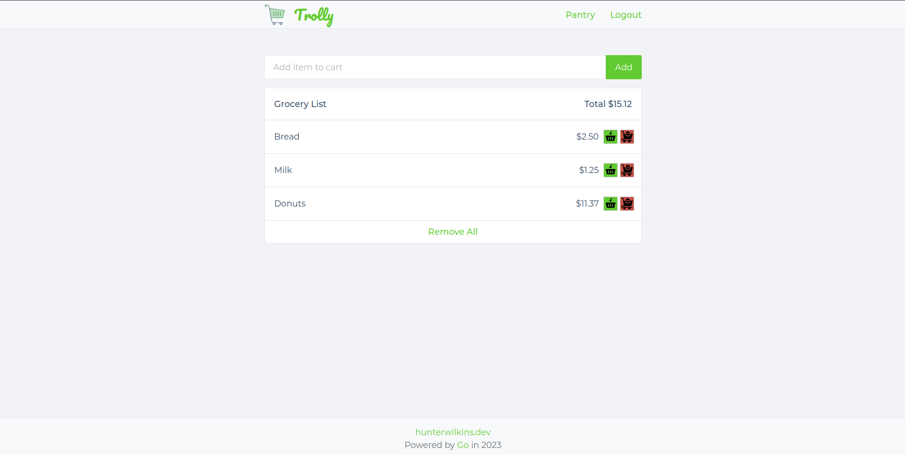

# Trolly

<p align="center">
    
</p>

Trolly is a self-hosted minimal grocery list app written in go.

## Install with docker-compose

To install with docker-compose run:

```
$ make docker-compose/up
```

## Author

[Hunter Wilkins](https://hunterwilkins.dev)
